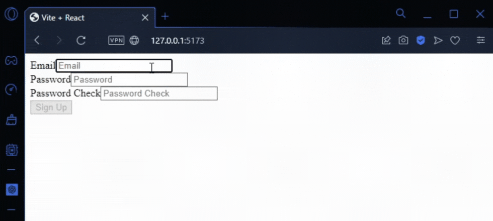
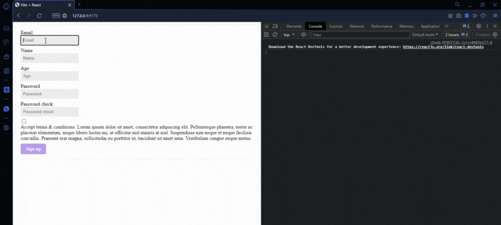

# Registration Form with Validation - React Forms

This project showcases two implementations of registration forms using ReactJS to provide a smooth and secure user experience. Users can register by providing personal information such as name, email address, password, etc. In the first implementation, React useState hooks are used to manage the state of each form field. Additionally, in the second implementation, a form is created using the custom useForm hook, which encapsulates form logic and simplifies state management and field validations. 

User input is validated in real-time, ensuring that the entered data is valid before submission.

### Prerequisites

To use this application, you need to have knowledge of:

+ Node.js - Runtime environment for JavaScript.
+ ReactJS - JavaScript library for building interactive and reactive user interfaces.

### Installing and Running the Project

To download this project, run the following command down below.

```
git clone https://github.com/JuanPablo70/ReactForms.git
```

Once the project is downloaded, open it in your favorite code editor such as VSCode and execute the following commands in the terminal:

```
npm install

npm run dev
```

In a web browser, visit the link [MoviesReact](http://127.0.0.1:5173/) to view the project.

### Project Functionality

This project has two main branches:

**main:** In this branch, the registration form has been developed using React's **useState** hooks. Each field in the form has its own state managed by the **useState** hook, enabling real-time validation and providing an interactive user experience.



**useForm:** In the useForm branch, the registration form has been created using a custom hook called **useForm**. This hook encapsulates the form logic, managing the states and validations of the fields. It offers an organized and reusable way to handle complex forms.



### Build With

+ [Vite](https://vitejs.dev) - Next Generation Frontend Tooling
+ [React](https://es.react.dev) - The library for web and native user interfaces

### Version

1.0

### Author

[JuanPablo70](https://github.com/JuanPablo70)